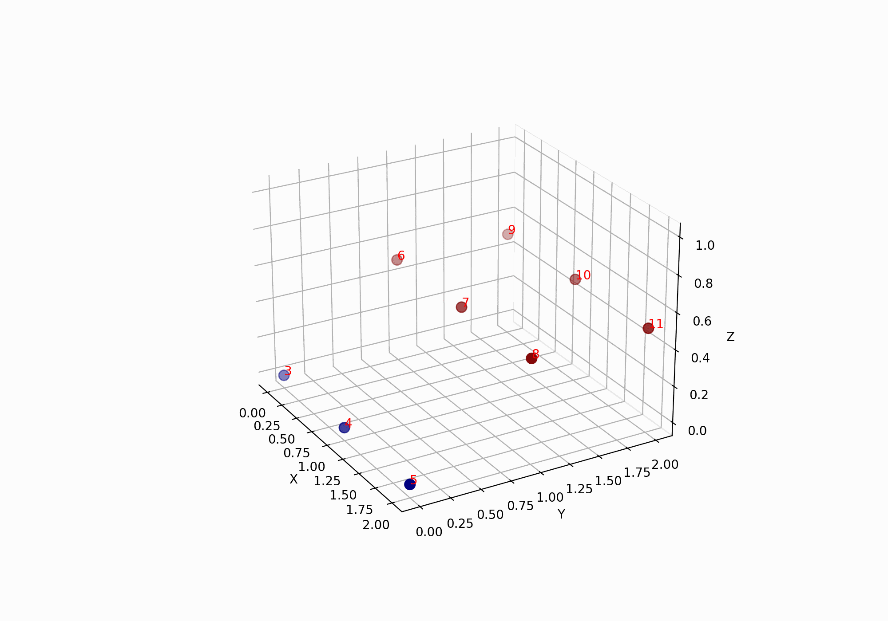
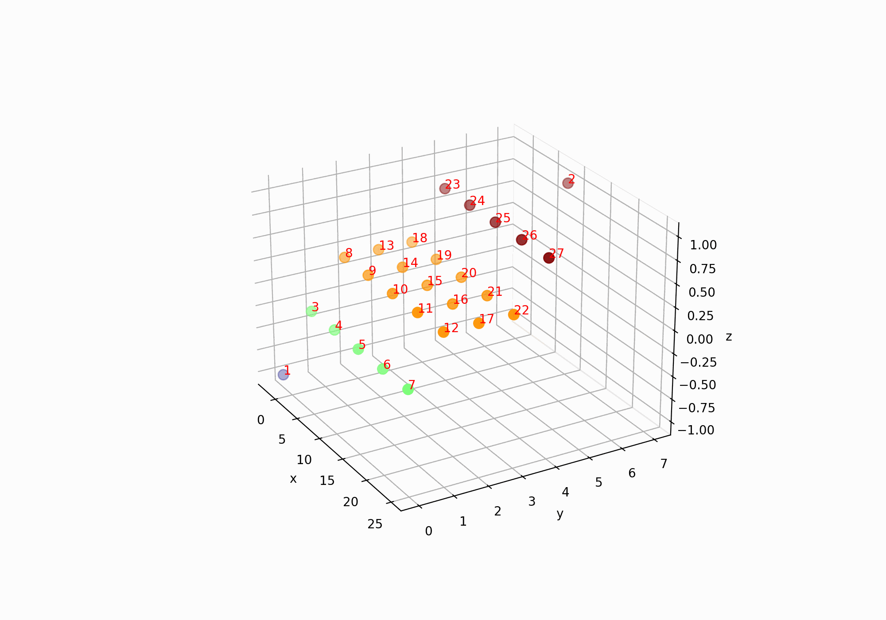
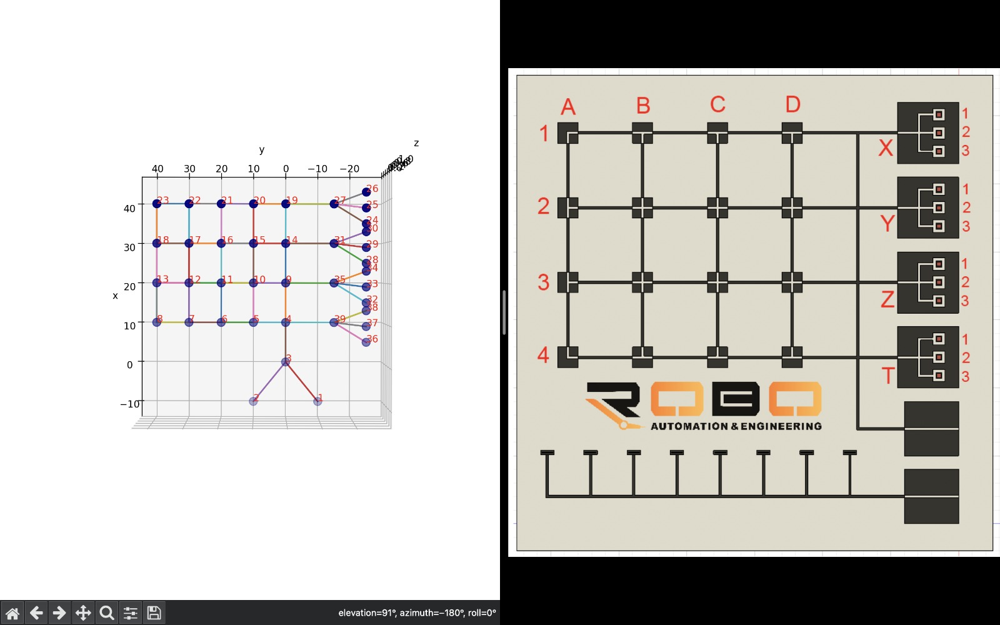

<p align="center">
  <a href="" rel="noopener">
 </a>
</p>

<h3 align="center">Simultaneous Multi-Way Linked-list</h3>

<div align="center">

[]()

[!Custom License](/LICENSE)

</div>

---

<p align="center"> A multi-way linked-list approach with multi-threaded search algorithms
    <br> 
</p>

## 📝 Table of Contents

- [📝 Table of Contents](#-table-of-contents)
- [🧐 About ](#-about-)
- [🧐 What is Multi-Way Linked-List ](#-what-is-multi-way-linked-list-)
- [🧐 What is Unordered Priority Independent non-Blocking Multi-Dimensional Linked Lists ](#-what-is-unordered-priority-independent-non-blocking-multi-dimensional-linked-lists-)
- [🏁 Getting Started ](#-getting-started-)
  - [Prerequisites](#prerequisites)
  - [Installing](#installing)
- [🎈 Usage ](#-usage-)
- [✍️ Authors ](#️-authors-)

## 🧐 About <a name = "about"></a>

Simultaneous Multi-Way Linked-List is a data structure designed for efficient storage and retrieval of multiple sequences of data. It is an extension of the classic linked-list data structure, which allows nodes to be linked together in a linear fashion. In contrast, the Simultaneous Multi-Way Linked-List allows nodes to be linked together in multiple directions, enabling the creation of multiple sequences of data that can be searched, accessed and modified simultaneously.

The Simultaneous Multi-Way Linked-List data structure is ideal for applications that require the management of multiple sequences of data, such as in database management, file systems, and scheduling systems. But there are a few topics that inspired the project. Actually, the project was initially developed for logistics mapping and finding optimal routes ([MeanMachineProject](https://gitlab.com/msaidbilgehan/MeanMachineProject)), and the algorithm found in this step was documented in an article ([Connection World in Robot Mind](https://www.researchgate.net/publication/353793701_Connection_World_in_Robot_Mind)). Then, it was restructured, taking inspiration from neural networks because of its resemblance to neural connections. There are many areas that need to be further developed, but it is clear that it is more successful than the linked-list approaches found in the literature. With its ability to support multiple sequences of data, the Simultaneous Multi-Way Linked-List allows for efficient storage and retrieval of data, reducing the time and resources required for complex operations.

One of the key benefits of the Simultaneous Multi-Way Linked-List data structure is its ability to handle concurrent access by multiple processes. It provides an efficient mechanism for synchronization of multiple concurrent accesses, ensuring consistency and data integrity.

The Simultaneous Multi-Way Linked-List data structure is implemented using a combination of linked lists and trees. Nodes are organized into a hierarchical structure, with each node containing a pointer to its parent and one or more pointers to its children. This structure allows for efficient traversal and manipulation of the data, while maintaining the integrity of the multiple sequences of data.

In summary, the Simultaneous Multi-Way Linked-List is a powerful data structure that provides efficient storage and retrieval of multiple sequences of data, while allowing for concurrent access by multiple processes. Its hierarchical structure and efficient synchronization mechanism make it an ideal choice for complex applications that require the management of large amounts of data.





## 🧐 What is Multi-Way Linked-List <a name = "what_is_multi-way_linked-list"></a>

A multi-way linked list is a data structure similar to a traditional linked list, but where each node has multiple pointers to other nodes, rather than just one. In a multi-way linked list, each node can have any number of pointers to other nodes, rather than just a single next node pointer.

This type of linked list can be useful in situations where you need to represent more complex relationships between nodes than a traditional linked list can handle. For example, you might use a multi-way linked list to represent a hierarchical structure such as a tree, where each node has pointers to its parent and its children.

One common implementation of a multi-way linked list is called a "skip list", which is a data structure that allows for efficient searching and insertion operations. In a skip list, each node has multiple forward pointers that allow for efficient traversal of the list without needing to follow every link.

Overall, multi-way linked lists can be a useful tool for representing complex relationships between data items, and can offer improved performance in certain situations over traditional linked lists.

## 🧐 What is Unordered Priority Independent non-Blocking Multi-Dimensional Linked Lists <a name = "What_is_Unordered_Priority_Independent_non-Blocking_Multi-Dimensional_Linked_Lists"></a>


Unordered Priority Independent non-Blocking Multi-Dimensional Linked Lists (UPIMDLL) is a data structure that combines several features to provide efficient and scalable access to multi-dimensional data.

The term "unordered" in UPIMDLL refers to the fact that elements can be added or removed from the list in any order. "Priority independent" means that elements in the list are not ordered by priority, and can be accessed and modified independently of each other. "Non-blocking" means that multiple threads can access the list simultaneously without causing conflicts or deadlocks.

UPIMDLLs are designed to store multi-dimensional data, which can be accessed and manipulated using a set of multi-dimensional queries. The structure is implemented as a linked list, where each node contains a set of multi-dimensional data points, and links to other nodes.

UPIMDLLs use a combination of hashing and collision resolution techniques to efficiently insert, search, and delete elements in the list. This allows for fast access to multi-dimensional data, even in large-scale distributed systems.

Overall, UPIMDLLs are a powerful data structure for managing multi-dimensional data in concurrent and distributed environments. They have applications in a wide range of fields, including data mining, machine learning, and scientific computing.

## 🏁 Getting Started <a name = "getting_started"></a>

These instructions will get you a copy of the project up and running on your local machine for development and testing purposes. See [deployment](#deployment) for notes on how to deploy the project on a live system.

### Prerequisites

What things you need to install the software and how to install them.

```
python
```

### Installing

A step by step series of examples that tell you how to get a development env running.

Say what the step will be

```
install python
create virtual environment
activate virtual environment
install requirements.txt (not necessary)
```

And run

```
python example.py
```

## 🎈 Usage <a name="usage"></a>

Add notes about how to use the system.

"Container" class contains useful features as creating nodes, connecting nodes, two different search algorithms, and so on...

"Node" class is a node for storing data or running some task simultaneously wih other nodes. 

"Gate" class contains input gate node and output gate node for creating an input and output connections to other nodes

"Search_History" class contains a struct that prevents race condition between threads at any search operation.

"Neuron" is a node type which is still at development. Please do not use it.
## ✍️ Authors <a name = "authors"></a>

- [@msaidbilgehan](https://github.com/msaidbilgehan) - Idea & Initial work
